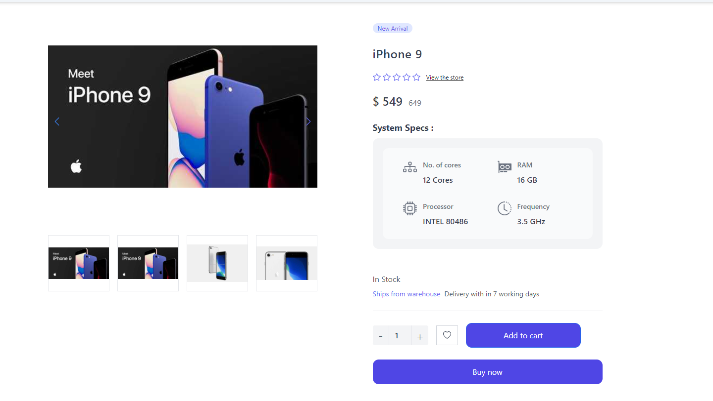
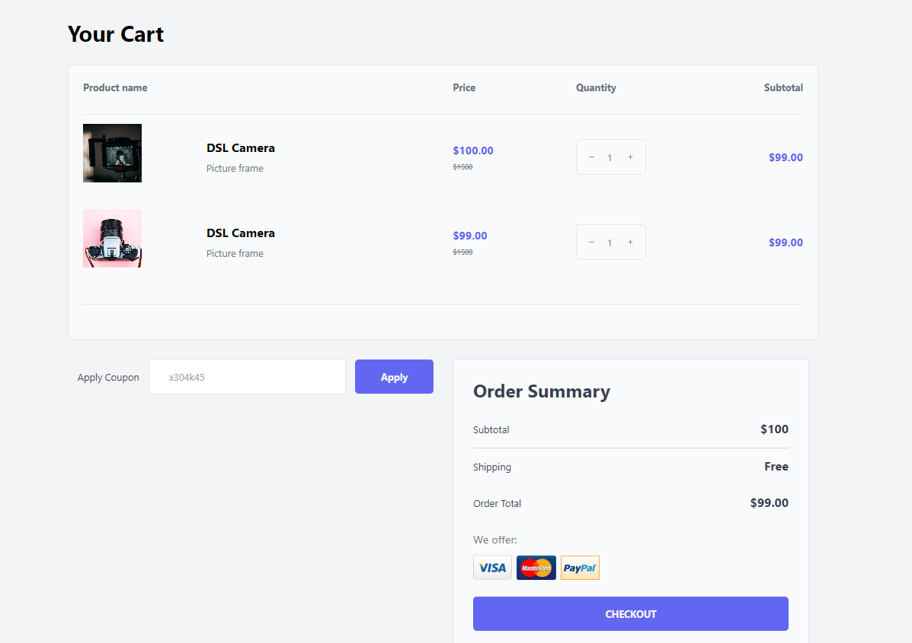

# ReactJS Ecomm template build with Tailwind CSS

Simple Ecomm template build with ReactJs and React Router Dom.

# Installation

- to run in locally for education purpose
- Download or clone repository.
- Node.js is required to run the application
- npm install to install the required packages as per package.json

# Usage

- use this template to build any ecomm website
- The application will run on any browser.

# live application

[Live Link of App](https://react-ecomm-tailwind-template.vercel.app/)

# Below are the sample pages of command line application

## Home Page

## Single Product Page

## Shopping Cart Page

# Features and Technologies uses

- React.js
- React Router Dom
- Tailwind CSS
- HTML
